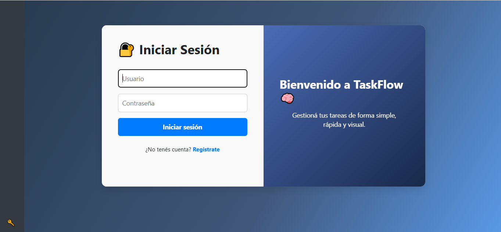
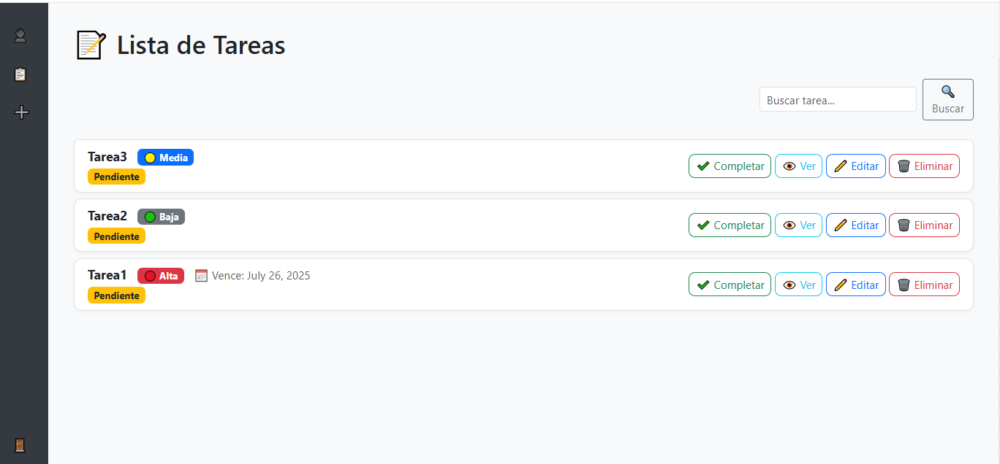
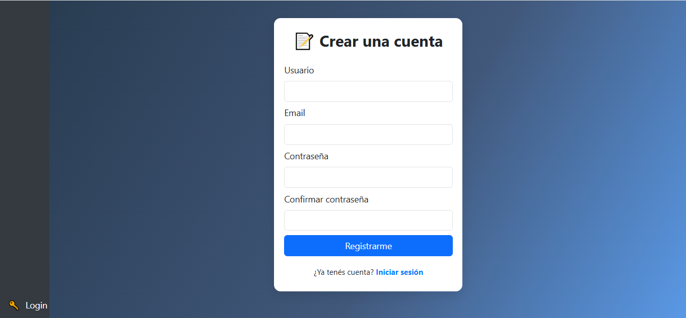

# TaskFlow 🧠

**TaskFlow** es una aplicación web desarrollada con Django para la gestión de tareas personales. Pensada para organizar, priorizar y visualizar tus tareas de manera simple y moderna, permitiendo que cada usuario vea y administre únicamente sus propias tareas.

## 🚀 Características principales

- **Autenticación de usuarios**: Registro, login y logout con un diseño visual moderno y seguro.
- **Gestión de tareas por usuario**: Cada usuario sólo puede ver y administrar sus propias tareas.
- **CRUD de tareas**: Crear, leer, editar y eliminar tareas fácilmente.
- **Prioridades**: Asignación de prioridades (alta, media, baja) visualmente destacadas.
- **Estados de tarea**: Completar o marcar como pendiente cada tarea con un clic.
- **Filtrado y búsqueda**: Buscar tareas por nombre y filtrar por estado (pendiente, completada, todas).
- **Vencimiento**: Agregar fecha de vencimiento opcional a cada tarea.
- **Paginación**: Navegá fácilmente por muchas tareas.
- **Confirmación visual para eliminar**: Eliminá tareas de forma segura con un modal de confirmación.
- **Diseño moderno y responsivo**: Interfaz atractiva con Bootstrap 5 y estilos personalizados.
- **Mensajes flash**: Notificaciones de éxito, error o advertencia que desaparecen automáticamente.

## 🖥️ Capturas de pantalla

  
  



---

## ⚙️ Instalación y ejecución

1. **Cloná el repositorio**
   ```bash
   git clone https://github.com/LuisMiraglio/Python-Django-Proyect.git
   cd Python-Django-Proyect

2. **Crear un entorno virtual (opcional pero recomendado)**
   ```bash
   python -m venv env

3. **Activar el entorno virtual**
   ```bash
   .\env\Scripts\Activate.ps1

4. **Instalar las dependencias**
   ```bash
   pip install -r requirements.txt

5. **Aplicar migraciones de base de dato**
   ```bash
   python manage.py migrate

6. **(Opcional) Crear un usuario administrador**
   ```bash
   python manage.py createsuperuser

7. **Iniciar el servidor**
   ```bash
   python manage.py runserver

8. **Entrar a la aplicación**
   ```bash
   http://127.0.0.1:8000/
   
🛠️ Tecnologías utilizadas

Python 3

Django

Bootstrap 5

HTML5, CSS3, JavaScript

🤝 Contribuciones
Si querés contribuir con mejoras o nuevas funcionalidades, podés abrir un pull request o issue en GitHub.

📄 Licencia
Este proyecto está bajo la licencia MIT. Revisá el archivo LICENSE para más detalles.

¡Gracias por usar TaskFlow! 🙌


